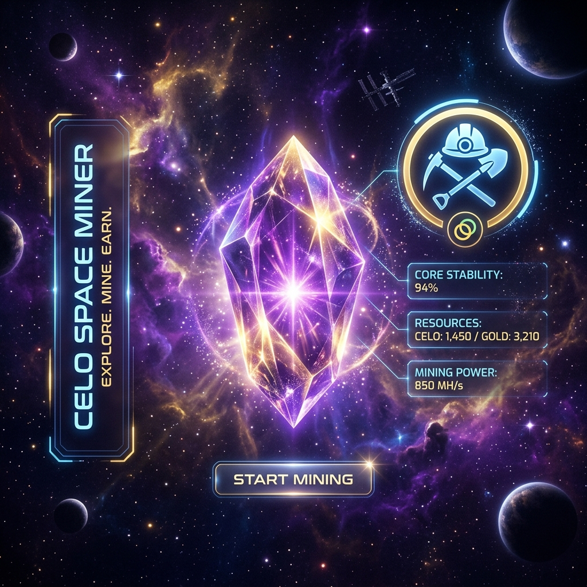
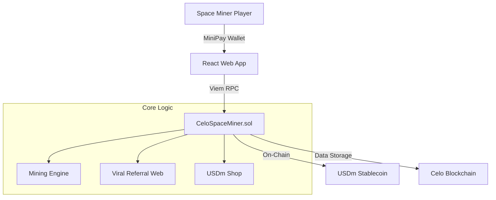

# 🚀 Celo Space Miner



**Celo Space Miner** is a high-interaction, gamified MiniPay DApp built to showcase the power of the Celo blockchain. Designed for the **Talent Protocol Celo MiniPay Challenge**, it focuses on deep on-chain engagement through daily rewards, a robust referral system, and complex smart contract interactions.

> [!NOTE]  
> Last updated: May 16, 2026 - Production Build v1.1.2

---

## 🌟 Key Features

- **💎 Interactive Mining**: Tap the cosmic crystal to gather 'Celo Dust'—the primary resource of the Space Miner ecosystem.
- **📅 Daily Check-ins**: Return every 24 hours to claim bonus Dust and maintain your on-chain activity streak.
- **🔗 Referral Network**: Invite fellow miners to the ecosystem and earn rewards when they start their journey.
- **🏆 Achievement System**: Unlock prestigious badges like 'Dust King' and 'Master Recruiter' based on your on-chain performance.
- **📊 Live Leaderboard**: Compete with miners globally to secure the top spot on the cosmic rankings.
- **🛠️ Tool Upgrades**: Use your Dust and USDm to purchase Auto-Miners and Laser Pickaxes directly on-chain.

---

## 🛠️ Technology Stack

- **Smart Contracts**: Solidity ^0.8.20 (Foundry)
- **Frontend**: React + Vite + TypeScript
- **Web3 Integration**: Viem + Wagmi
- **Styling**: Premium Glassmorphism UI (CSS3)
- **Stablecoin Integration**: USDm (Celo native)

## 🏗️ Technical Architecture



---

## 🚀 Getting Started

### Prerequisites

- [Foundry](https://book.getfoundry.sh/getting-started/installation) (for contract development)
- [Node.js](https://nodejs.org/) (for frontend)

### Installation

1. **Clone the repository**
   ```bash
   git clone https://github.com/bakarezainab/SpaceMiner.git
   cd SpaceMiner
   ```

2. **Setup Smart Contracts**
   ```bash
   cd contract
   forge install
   forge build
   ```

3. **Setup Frontend**
   ```bash
   cd ../frontend
   npm install
   npm run dev
   ```

---

## 📜 Smart Contract Architecture

The core logic resides in `CeloSpaceMiner.sol`. It handles:
- User state and resource management.
- USDm payment processing for upgrades.
- Referral verification and reward distribution.
- Leaderboard data aggregation.

### Deployment (Celo Sepolia)
```bash
forge script script/Deploy.s.sol:Deploy --rpc-url https://forno.celo.org --broadcast
```

---

## 🤝 Contributing

This project is part of a competition. Feedback and suggestions are welcome!

---

## 📄 License

MIT License - feel free to use and build upon this project.

---

Created with 💜 by **bakarezainab** for the Celo MiniPay Challenge.
